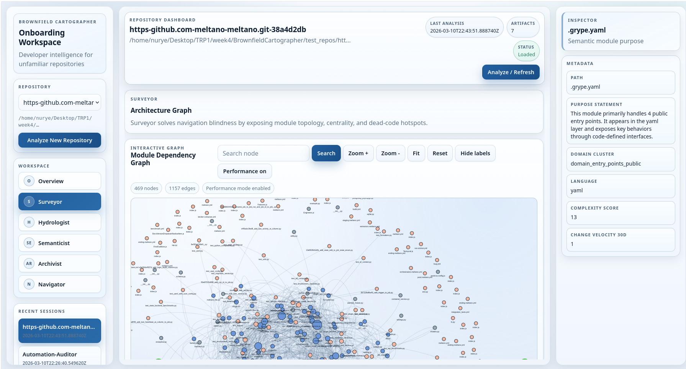

# Brownfield Cartographer

Brownfield Cartographer is a developer intelligence workspace for fast onboarding into unfamiliar repositories.
It analyzes architecture, lineage, semantics, and documentation, then exposes results through CLI tools and a React dashboard.

## Dashboard



## What It Does

- Builds a module-level architecture graph with centrality and dead-code signals.
- Extracts lineage across Python, SQL, YAML, and notebooks.
- Generates semantic module summaries, domain clusters, and doc-drift flags.
- Produces onboarding artifacts (`CODEBASE.md`, `onboarding_brief.md`, trace/state files).
- Supports interactive queries (`find_implementation`, `explain_module`, `trace_lineage`, `blast_radius`).
- Provides a multi-session web workspace with intake, dashboards, graphs, and inspector panels.

## Agent Overview

| Agent | Primary Output |
| --- | --- |
| Surveyor | Module dependency graph, hotspots, centrality hints |
| Hydrologist | Upstream/downstream lineage and blast radius context |
| Semanticist | Purpose statements, clustering, drift detection |
| Archivist | Living docs and state snapshots |
| Navigator | Query interface over architecture + lineage evidence |

## Tech Stack

- Python 3.11+
- FastAPI + Uvicorn backend (workspace API)
- React + Vite frontend
- NetworkX / parser tooling for graph + repository analysis

## Quick Start

### 1. Clone and install

```bash
git clone <your-fork-or-repo-url>
cd BrownfieldCartographer

python -m venv .venv
. .venv/bin/activate
python -m pip install -U pip
python -m pip install -e ".[dev]"
```

### 2. Build the frontend

```bash
cd frontend
npm install
npm run build
cd ..
```

### 3. Analyze a repository

Local path:

```bash
. .venv/bin/activate
python -m src.cli analyze /path/to/repo --output .cartography
```

GitHub URL:

```bash
. .venv/bin/activate
python -m src.cli analyze https://github.com/dbt-labs/jaffle_shop --output .cartography
```

## Run the Workspace UI

```bash
. .venv/bin/activate
python -m src.cli workspace /path/to/repo --output .cartography --host 127.0.0.1 --port 8765
```

What you get in the UI:

- Repository intake and multi-repo session switching
- Summary metrics dashboard
- Interactive architecture and lineage graphs
- Semantic search and module purpose views
- Navigator query console with history
- Inspector side panel for evidence and metadata
- Archivist views for `CODEBASE.md`, onboarding brief, trace, and state

## CLI Commands

All commands are available via `python -m src.cli ...` (or `cartographer ...` after installing scripts).

### Analyze

```bash
python -m src.cli analyze <repo-path-or-github-url> --output .cartography --incremental
```

### Query

```bash
python -m src.cli query /path/to/repo explain_module src/orchestrator.py
python -m src.cli query /path/to/repo find_implementation revenue
python -m src.cli query /path/to/repo trace_lineage dataset::orders --direction upstream
python -m src.cli query /path/to/repo blast_radius src/transforms/revenue.py
```

### Visualize standalone HTML graphs

```bash
python -m src.cli visualize /path/to/repo --open-browser
```

## Output Artifacts

By default, artifacts are written to `<repo>/.cartography/`:

- `module_graph.json`
- `lineage_graph.json`
- `semantic_index/module_purpose_index.jsonl`
- `CODEBASE.md`
- `onboarding_brief.md`
- `cartography_trace.jsonl`
- `state.json`
- `module_graph.html` and `lineage_graph.html` (after `visualize`)

## Repository Input Behavior

- Local repo inputs are normalized into the workspace `test_repos/` mirror.
- GitHub URLs are shallow-cloned into `test_repos/<repo-name>`.
- Existing mirrored repos are refreshed on subsequent runs.

## Optional Local LLM (Ollama)

If you want local-model support, set:

```bash
export OLLAMA_HOST=http://127.0.0.1:11434
export CARTOGRAPHER_MODEL_FAST=llama3.2:3b
export CARTOGRAPHER_MODEL_SYNTH=llama3.1:8b
export CARTOGRAPHER_EMBED_MODEL=nomic-embed-text
```

When Ollama is unavailable, semantic flows fall back to deterministic local heuristics.

## Development Notes

- Backend source: `backend/`
- Core analysis + agents: `src/`
- Frontend app: `frontend/`
- Tests: `tests/`

Run tests:

```bash
. .venv/bin/activate
pytest -q
```
