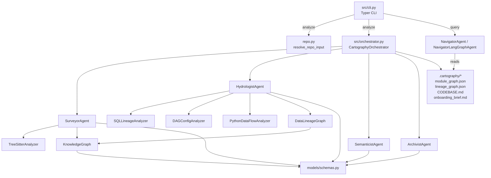

# System Map

Generated on 2026-03-10 from the current workspace using:

```bash
. .venv/bin/activate
python -m src.cli analyze . --output .cartography --no-incremental
pytest -q
```

## 1) Visual Architecture Map



## 2) Entry Points

- CLI analyze: `python -m src.cli analyze <repo>`
- CLI query: `python -m src.cli query <repo> <tool> <arg>`
- Package script: `cartographer` -> `src.cli:app`
- Programmatic orchestration: `CartographyOrchestrator.analyze()`
- Query tool dispatch: `NavigatorLangGraphAgent.run()`

## 3) Services / Modules

- Orchestration: `src/orchestrator.py`
- Ingestion of target repo: `src/repo.py`
- Agents:
  - `src/agents/surveyor.py` (module map + complexity + git velocity)
  - `src/agents/hydrologist.py` (SQL/YAML/Python lineage)
  - `src/agents/semanticist.py` (purpose + clustering + day-one synthesis)
  - `src/agents/archivist.py` (artifact writer)
  - `src/agents/navigator.py` (query interface)
- Analyzers:
  - `src/analyzers/tree_sitter_analyzer.py`
  - `src/analyzers/sql_lineage.py`
  - `src/analyzers/dag_config_parser.py`
  - `src/analyzers/python_dataflow.py`
- Graph/model core:
  - `src/graph/knowledge_graph.py`
  - `src/graph/data_lineage_graph.py`
  - `src/models/schemas.py`

## 4) Critical Paths

### Analyze Path (primary runtime path)
1. `src/cli.py::analyze`
2. `src/repo.py::resolve_repo_input`
3. `src/orchestrator.py::analyze`
4. `SurveyorAgent.run` -> module/function graph
5. `HydrologistAgent.run` -> lineage graph
6. `SemanticistAgent.run` + `answer_day_one_questions`
7. `ArchivistAgent.*` -> writes `.cartography/*`

### Query Path (read-only operational path)
1. `src/cli.py::query`
2. Load `.cartography/module_graph.json` and `.cartography/lineage_graph.json`
3. `NavigatorLangGraphAgent.run` (or fallback router)
4. Tool execution:
   - `find_implementation`
   - `trace_lineage`
   - `blast_radius`
   - `explain_module`

## 5) Current Graph Snapshot

- Module graph: 65 nodes, 31 edges
  - Node types: 39 `module`, 26 `function`
  - Edge types: 26 `CONFIGURES`, 5 `CALLS`
- Lineage graph: 11 nodes, 6 edges
  - Edge types: 3 `CONFIGURES`, 2 `CONSUMES`, 1 `PRODUCES`
- Tests: 12 passed (`pytest -q`)

## 6) Dead Code Detection

### Heuristic currently in code
- `SurveyorAgent` flags a module as dead-code candidate if:
  - it has public functions, and
  - graph in-degree is zero.

### Important caveat
- Import edges are currently under-populated because import extraction stores symbol-qualified strings (for example `src.repo.resolve_repo_input`), while edge resolution expects module-like paths.
- Result: many `src/*` modules are false positives in dead-code candidate output.

### Practical shortlist (higher confidence)
- Likely low-risk/auxiliary modules:
  - `src/__init__.py`
  - `src/agents/__init__.py`
  - `src/analyzers/__init__.py`
  - `src/graph/__init__.py`
  - `src/models/__init__.py`
- No obviously unused top-level functions were found in `src/` by symbol scan.

## 7) Queryable Commands

```bash
# Rebuild map
python -m src.cli analyze . --output .cartography --no-incremental

# Explain a module
python -m src.cli query . explain_module src/orchestrator.py

# Blast radius from a module
python -m src.cli query . blast_radius src/orchestrator.py

# Trace lineage from a dataset (upstream)
python -m src.cli query . trace_lineage dataset::orders_raw --direction upstream

# List dead-code candidates from artifact
jq -r '.nodes[] | select(.node_type=="module" and .is_dead_code_candidate==true) | .id' .cartography/module_graph.json
```
